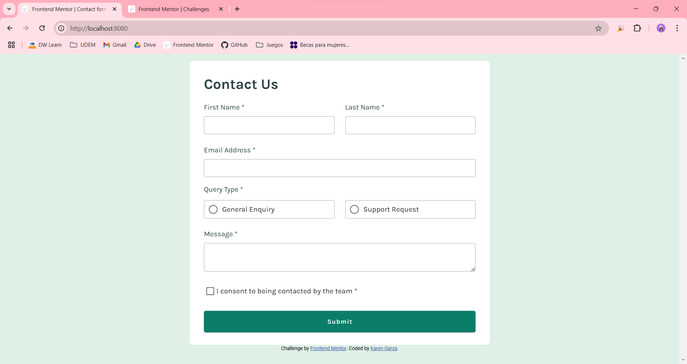

# Frontend Mentor - Contact form solution

This is a solution to the [Contact form challenge on Frontend Mentor](https://www.frontendmentor.io/challenges/contact-form--G-hYlqKJj). Frontend Mentor challenges help you improve your coding skills by building realistic projects. 

## Table of contents

- [Overview](#overview)
  - [The challenge](#the-challenge)
  - [Screenshot](#screenshot)
  - [Links](#links)
- [My process](#my-process)
  - [Built with](#built-with)
  - [What I learned](#what-i-learned)
  - [Continued development](#continued-development)
  - [Useful resources](#useful-resources)
- [Author](#author)

## Overview

### The challenge

Users should be able to:

- Complete the form and see a success toast message upon successful submission
- Receive form validation messages if:
  - A required field has been missed
  - The email address is not formatted correctly
- Complete the form only using their keyboard
- Have inputs, error messages, and the success message announced on their screen reader
- View the optimal layout for the interface depending on their device's screen size
- See hover and focus states for all interactive elements on the page

### Screenshot



### Links

- [Live site URL](https://your-live-site-url.com)

## My process

### Built with

- HTML5
- CSS
- JavaScript
- [Vue.js](https://vuejs.org/) - JavaScript framework
- [Vuetify](https://vuetifyjs.com/en/) - Collection of pre-made components. This helped with the styles and layout.

### What I learned

#### Form validation with Vue.js and Vuetify

First, declare the rules in the ```<script>``` section of the component.

```js
// Rules for form
const rules = ref({
  required: v => !!v || 'This field is required',
  validMail: v => /^\w+([.-]?\w+)*@\w+([.-]?\w+)*(\.\w{2,3})+$/.test(v) || 'Please enter a valid email address'
});
```

And then, use this rules in the ```<template>``` section of the component.

```html
<v-text-field variant="outlined" 
              color="primary"
              hide-details="auto"
              density="compact"
              :rules="[rules.required]"
              v-model="lastName">
</v-text-field>
```

### Continued development

- Styling everything without Vuetify components. This could make the styles more similar to the design screenshots (specifically, the hover and active states for inputs.)

### Useful resources

- [Create a Vue.js project](https://vuejs.org/guide/quick-start.html#creating-a-vue-application) - How to create a Vue project. In this link, the official documentation can also be found.
- [Vuetify documentation](https://vuetifyjs.com/en/) - This documentation helped me to add Vuetify to my project, and to understand how to use different components.

## Author

- Frontend Mentor - [@KarenNR](https://www.frontendmentor.io/profile/KarenNR)